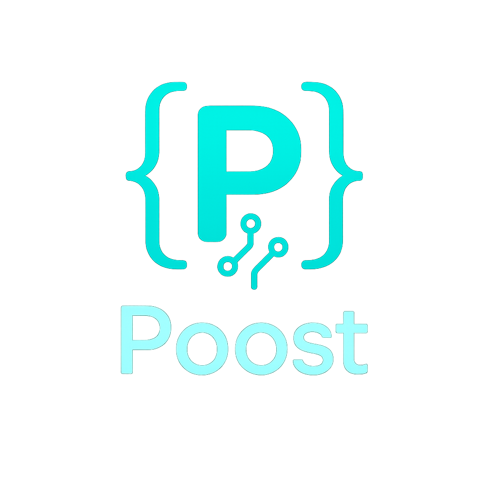

<p align="center">
  
</p>

<p align="center"><b>Simple HTTP API for any Ere-compliant zkVM.</b></p>

Poost is an API wrapper on top of `ere` allowing you to execute, verify and create zkVM proofs by calling a HTTP endpoint.

---

## Table of Contents

1. [Features](#features)
2. [Quick Start](#quick-start-example)
3. [Manual Build](#manual-build)
4. [API](#api)
5. [Supported Backends](#supported-backends)
6. [Contributing](#contributing)
7. [License](#license)

---

## Features

* **REST API** for execution, proof generation, and verification.
* **Pluggable Backend Support**: Leverages `Ere` for backend integration.

---

## Quick Start (Example)

This example assumes you have Poost server running (e.g., via manual build or a future Docker image).

> The easiest way to start is by running the `test_workflow.sh` script.

**1. Execute a Program (Get Execution Metrics)**

```bash
curl -X POST http://localhost:3000/execute \
     -H "Content-Type: application/json" \
     -d '{
           "program_id": "sp1",
           "input": {
             "value1": 10,
             "value2": 100
           }
         }'
```

Expected response (metrics):

```json
{
  "program_id": "sp1",
  "total_num_cycles": 4866,
  "region_cycles": { /* ... */ },
  "execution_time_milliseconds": 70
}
```

**2. Generate a Proof**

```bash
curl -X POST http://localhost:3000/prove \
     -H "Content-Type: application/json" \
     -d '{
           "program_id": "sp1",
           "input": {
             "value1": 10,
             "value2": 100
           }
         }'
```

Expected response:

```json
{
  "program_id": "sp1",
  "proof": "proof-data...",
  "proving_time_milliseconds": 8000
}
```

## Manual Build

### Prerequisites

* **Rust** ≥ 1.80
* **zkVM Toolchain** Visit the respective zkVMs docs or checkout Ere on how to install.

```bash
# 1. Clone
git clone https://github.com/eth-applied-research-group/poost.git && cd poost

# 2. Build server
cargo build --release

# 3. Run
cargo run --release
```

> Some zk‑VMs require **release** mode for proofs to finish in a reasonable time.

---

## API

The following endpoints are available:

| Endpoint   | Method | Purpose                                     |
|------------|--------|---------------------------------------------|
| `/info`    | `GET`  | Get server and system information           |
| `/execute` | `POST` | Run program and get execution metrics       |
| `/prove`   | `POST` | Generate proof for a program with inputs    |
| `/verify`  | `POST` | Verify a previously generated proof         |

## Supported Backends

Poost uses `Ere` for backend integration. Not all backends will be integrated, however since the API for Ere is the same for all, it is easy to add backends already supported by Ere.

## Contributing

Contributions are welcome!

## License

Dual‑licensed under **Apache‑2.0** and **MIT**. Choose either license at your discretion.
